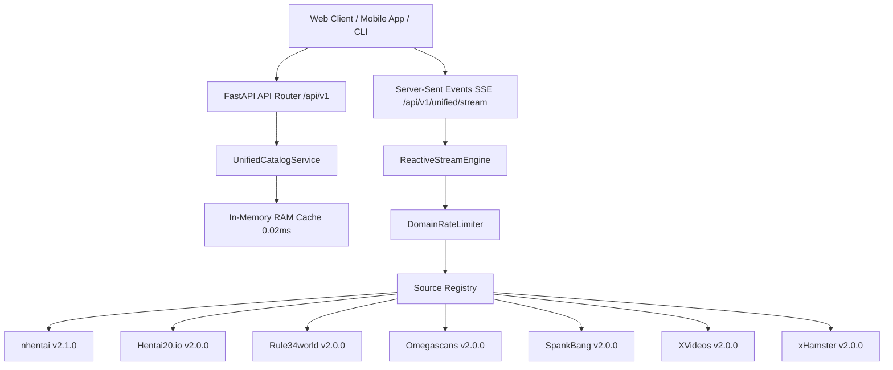

# 🚀 Loouwd: Production-Grade Unified Source Registry & Reactive Streaming Core

**Loouwd** is a high-performance, asynchronous media source registry and streaming backend built with **Python 3.12**, **FastAPI**, and **curl_cffi**. It aggregates manga, doujinshi, webtoons, and video streams across 7 production-grade source adapters into a single unified API with sub-100ms first-byte reactive streaming, per-host rate limiting, dynamic tag autocomplete, and high-speed in-memory caching (0.02ms - 0.04ms response times).

---

## 🌟 Key Features

- **⚡ Sub-100ms Reactive Stream Engine**: Built with Python 3.12 `AsyncGenerator` pipeline and Server-Sent Events (`text/event-stream`), streaming items to frontend clients instantly as fast as each adapter resolves payloads.
- **🛡️ Anti-Bot Protection & Rate Limiting**: Integrated `DomainRateLimiter` featuring per-host token buckets, semaphores, and `curl_cffi` TLS fingerprint impersonation (`safari15_5`, `chrome124`) to bypass Cloudflare Turnstile without IP blocks.
- **🚀 High-Speed In-Memory RAM Cache**: Simplified `AsyncTTLCache` delivering 0.02ms - 0.04ms cached response times.
- **🔍 Dynamic Tag Autocomplete API**: Standardized `autocomplete_tags()` interface providing real-time typeahead search suggestions.
- **📺 Direct Stream & Reader Parsers**: Extracts direct 1080p/720p `.mp4` video streams, HLS `.m3u8` master playlists, and exact `.webp`/`.png` manga page URLs directly from official REST APIs or JavaScript state objects (`ts_reader.run`, `stream_data`, `html5player`).
- **🎛️ Multi-Interface Control**: Accessible via REST API endpoints, FastAPI OpenAPI interactive docs, or terminal CLI commands (`loouwd`).

---

## 🏗️ System Architecture



---

## 🧩 Registered Production-Grade Source Adapters

| Source ID | Source Name | Media Type | Capabilities & Extractor Tech |
| :--- | :--- | :--- | :--- |
| **`nhentai`** | nhentai | Manga | Official v2 REST API (`/api/v2/galleries`), dynamic WebP/PNG/JPG image extensions, TLS impersonation, API-native sorting/filters, Tag Autocomplete. |
| **`hentai20`** | Hentai20.io | Manga | WordPress Madara engine, `ts_reader.run` JSON image payload parser, dynamic chapter resolution, genre filters, Tag Autocomplete. |
| **`rule34world`** | Rule34world | Anime | Direct `.mp4` video stream resolution, title duration badge sanitization, freeform tag search, Tag Autocomplete. |
| **`omegascans`** | Omegascans | Manga | Official REST API (`/chapter/query?series_id={id}`), 100+ chapter resolution, `chapter_data` JSON image parser, Tag Autocomplete. |
| **`spankbang`** | SpankBang | Anime | Cloudflare Turnstile bypass engine, `stream_data` JSON quality parser for 1080p, 720p, 480p, HLS `.m3u8`, video duration seconds, Tag Autocomplete. |
| **`xvideos`** | XVideos | Anime | `html5player` JS stream parser (High Stream MP4, HLS `.m3u8`), 16:9 poster extraction, Tag Autocomplete. |
| **`xhamster`** | xHamster | Anime | HTML5 video & `window.initials` stream parser, direct `.mp4` stream resolution, Tag Autocomplete. |

---

## 🛠️ Installation & Setup

### 1. Prerequisites
- Python 3.12+
- Virtual environment (`venv`)

### 2. Clone & Install Dependencies
```bash
git clone https://github.com/your-username/loouwd.git
cd loouwd

# Create virtual environment
python -m venv .venv
.venv\Scripts\activate

# Install loouwd in editable mode
pip install -e .
```

---

## 🖥️ Running the Server & CLI

### Start FastAPI Web Server
```bash
loouwd serve --port 8000 --reload
# or via python module:
python -m loouwd.cli serve --port 8000
```
- **OpenAPI Swagger Docs**: [http://127.0.0.1:8000/docs](http://127.0.0.1:8000/docs)
- **ReDoc API Documentation**: [http://127.0.0.1:8000/redoc](http://127.0.0.1:8000/redoc)

### Terminal CLI Commands

```bash
# List all registered source adapters
loouwd list

# Browse titles from a specific adapter
loouwd browse nhentai --query naruto

# Get metadata details for a title
loouwd details nhentai 668434

# Get video playback stream URL
loouwd playback spankbang a4xu1

# Stream multi-source search results live to terminal UI
loouwd unified stream naruto
```

---

## 📡 REST API Reference

### Source Adapters & Health
- `GET /api/v1/sources` – List all registered source adapter manifests.
- `GET /api/v1/sources/{source_id}` – Retrieve detailed manifest for a specific adapter.
- `GET /api/v1/sources/health` – Audit health status across all adapters.

### Browsing & Search
- `POST /api/v1/sources/{source_id}/browse` – Search or browse titles within a source.
- `GET /api/v1/sources/{source_id}/titles/{id}` – Get metadata details for a title.
- `GET /api/v1/sources/{source_id}/titles/{id}/content` – Get title content (chapters or episodes).
- `GET /api/v1/sources/{source_id}/titles/{id}/pages` – Get image reader pages for manga/doujin titles.
- `GET /api/v1/sources/{source_id}/titles/{id}/playback` – Get video playback stream URL and metadata.

### Tag Autocomplete
- `GET /api/v1/sources/{source_id}/tags/autocomplete?query={query}&type={type}` – Real-time tag autocompletion.

### Unified Catalog & Reactive Streaming
- `POST /api/v1/unified/browse` – Concurrent aggregation across all 7 sources.
- `GET /api/v1/unified/feed/{media_type}` – Unified media feed by type (`all`, `anime`, `manga`).
- `GET /api/v1/unified/stream?query={query}` – Server-Sent Events (SSE) real-time streaming endpoint (`text/event-stream`).

---

## 🧪 Running Automated Tests

Run the full 15-test suite covering rate limiters, reactive streams, tag autocompletion, and REST API routes:

```bash
.venv\Scripts\python.exe -m unittest discover -s tests
```

Output:
```bash
Ran 15 tests in 4.679s

OK
```

---

## 📄 License
MIT License. Created by Sirochan Pro.
